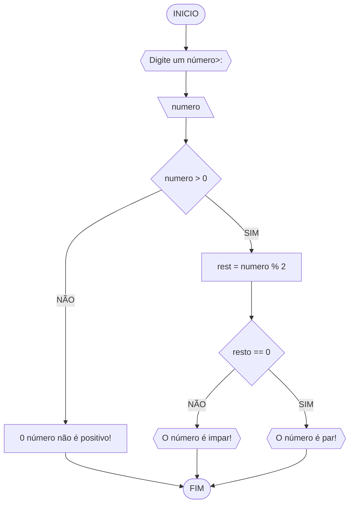

# UNIFOR
**Nome**:Lucas
**Disciplina**:Raciocínio lógico algorítmico
## Exercício 3
### Fluxograma

```mermaid
flowchart TD
A([INICIO])--> B{{Digite um número>:}}
B --> C[\numero\]
C --> D{numero > 0}
D --NÃO--> E[0 número não é positivo!]
D --SIM --> F[rest = numero % 2]
E --> Z([FIM])
F --> G{resto == 0}
G --NÃO--> H{{O número é impar!}}
G --SIM--> I{{O número é par!}}
H --> Z
I --> Z
```

 

